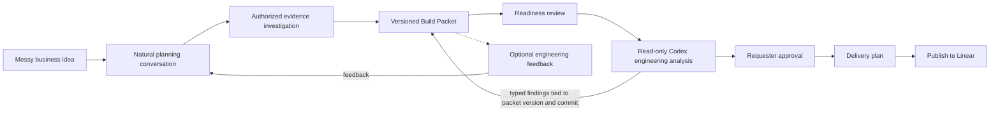

# Clio

> From an unclear business idea to a buildable, evidence-backed project.

Clio is a multi-tenant AI planning platform that helps business requesters and
engineering teams reach a shared, trustworthy definition of what should be
built. It guides a natural planning conversation, investigates authorized company and
repository context, exposes missing decisions, creates a versioned Build
Packet, coordinates requester and engineering review, and publishes an approved
delivery plan into the tools where execution happens.

**Document status:** Product contract for the MVP. Product assumptions remain
open until validated with prospective users. "Clio" is a working codename; the
public product name is not yet decided.

**Implementation status (2026-08-02):** This repository currently contains the
planning contract, not a verified Clio application. Rivet has been inspected as
a candidate foundation, but its snapshot has not yet been accepted, imported,
or re-verified inside this repository. Linear milestones and issues describe
planned outcomes; they are not evidence of completed behavior.

## How this project is organized

- This README is the durable product white paper and product contract.
- The Linear project overview is the executive summary and current status.
- Linear milestones describe testable product increments.
- Linear issues describe independently understandable outcomes and completion
  evidence. Engineering decides how the implementation is packaged.
- Architecture decisions and contracts live in repository documentation as they
  are accepted.
- Chat history, model output, and tickets are context, not proof of implemented
  behavior.

## Executive summary

Software requests often begin as incomplete business ideas:

> We need an agent that watches sales calls, identifies objections, and creates
> follow-up campaigns.

The requester understands the desired business outcome but may not know which
questions engineering needs answered. A ticket is created, but it frequently
contains ambiguous scope, missing workflows, hidden assumptions, unclear data
access, weak acceptance criteria, and technical choices that were never
validated. The developer must reconstruct the real request through meetings,
Slack threads, documents, and source code before implementation can safely
begin.

Clio addresses the work before ticket creation. It converts scattered intent
and evidence into an approved planning artifact that both sides can inspect,
challenge, revise, and trust. In V1, a bounded Codex engineering specialist
also inspects the exact packet version against an authorized, commit-pinned
repository snapshot before the human engineering review.

The ticket publisher is the final adapter. The valuable product is the process
that establishes shared understanding before publication.

## The problem

The handoff from a business requester to an engineering team loses context.

Business requesters usually know:

- what is painful today;
- who experiences the pain;
- what outcome they want;
- why the outcome matters now.

Developers additionally need:

- the current workflow and desired workflow;
- triggers, actors, states, and failure behavior;
- source systems and authoritative data;
- permissions, ownership, and approval boundaries;
- explicit requirements and non-goals;
- testable acceptance criteria;
- dependencies, risks, conflicts, and unresolved decisions;
- evidence from the current codebase and operating environment.

Today this translation is performed inconsistently by product managers,
business analysts, engineering leads, agencies, or developers themselves. When
it fails, the consequences include rework, planning meetings, inaccurate
tickets, implementation based on false assumptions, and business intent that
disappears after delivery begins.

### Job to be done

When a person has a software idea but cannot express it in engineering-ready
form, help them answer the consequential questions, ground the request in
available evidence, and reach an approved agreement with engineering so that
implementation can begin without reconstructing the original intent.

## Initial users

The first users are people who regularly request software from developers but
do not live in coding tools:

- nontechnical startup founders;
- GTM, RevOps, sales, and marketing leaders requesting internal tools;
- agency owners working with contracted developers;
- fractional executives;
- teams coordinating offshore or distributed engineering.

The first engineering users are developers and engineering leads who review
requests, identify architectural conflicts, and need durable context while
implementing the approved work.

The initial customer hypothesis is a small organization or agency where the
requester-to-developer handoff is frequent, expensive, and informal. This is an
assumption to validate, not an established market fact.

## Product promise

**Explain what you want to build. Clio turns it into a scoped, evidence-backed,
approved project your engineering team can execute.**

Clio should reduce ambiguity without pretending to replace engineering
judgment. It creates a clear boundary between three types of decisions:

### Business decisions

What problem is being solved, who experiences it, why it matters, and which
outcome is valuable.

### Product decisions

How the user workflow should behave, what belongs in the MVP, what is excluded,
and what counts as successful.

### Engineering decisions

How the system should be implemented, which architecture is appropriate, what
technical constraints exist, and how work should be estimated.

Clio may identify engineering questions and cite relevant repository evidence.
It must not present an unreviewed model inference as an accepted technical
decision.

## The core artifact: a Build Packet

A Build Packet is a versioned agreement about a proposed software project. It
remains connected to its evidence, decisions, reviews, delivery plan, and
published work.

A packet contains:

| Section | Purpose |
| --- | --- |
| Executive context | Why the organization wants the change |
| Business problem | The observed pain, affected users, and present impact |
| Desired outcome | The observable business or user result |
| Current state | How the workflow operates today |
| Proposed workflow | What should happen after the change ships |
| Requirements | What the product must do |
| Non-goals | What is explicitly excluded |
| Acceptance criteria | How completion and behavior are evaluated |
| Integrations and data | Systems, sources, ownership, and freshness |
| Permissions and approvals | Who may read, decide, approve, and execute |
| Evidence | Cited source material supporting or conflicting with claims |
| Assumptions and unknowns | Claims that remain unverified and how to validate them |
| Risks and dependencies | Conditions that could block or change delivery |
| Decisions | What was accepted, by whom, why, and for which packet version |
| Delivery plan | Proposed milestones, epics, tickets, and dependencies |
| Revision history | What changed, why it changed, and which approvals became stale |

The MVP supports two native ways to reach the same Build Packet contract:

- **Clio templates** provide opinionated, built-in forms for common planning
  outcomes.
- **Workspace tools** let an organization create its own reusable form by
  naming the questions it needs and optionally adding answer guidance, source
  context, and a requested value or output format.

Both appear as selectable tools in the chat composer. Selecting one guides the
conversation without disabling freeform chat, so a requester can answer the
form, ask questions, add context, and refine the resulting packet in one
surface. These tools are declarative planning contracts, not executable code
or arbitrary model/tool permissions.

Workspace tools are tenant scoped. Every member can discover and use them and
can see who created and last changed each version. The creator and workspace
Admins may edit, archive, or duplicate a tool; other Members cannot silently
change it. Every generated packet retains the exact tool and version used so a
later edit cannot rewrite the history of an approved packet.

Packet Templates are not conversation scripts. They define the durable output
contract and readiness policy. A workflow skill decides how Clio helps the user
reach that contract; the conversation remains adaptive.

## Adaptive delivery structure

Clio proposes the lightest tracking structure that keeps the work clear:

| Request shape | Default output |
| --- | --- |
| Small, bounded change | One issue in an existing project |
| Feature with separable outcomes | One parent issue with optional sub-issues |
| Larger coordinated build | A project with meaningful milestones, parent issues, and optional sub-issues |
| Unclear or unready request | Continue discovery; publish no issues yet |

The requester does not need to understand the hierarchy in advance. Clio
previews the proposed structure in plain language and lets the requester or
engineering reviewer simplify or expand it.

Clio defines business and product intent: the outcome, workflow, evidence,
requirements, constraints, acceptance criteria, dependencies, and unresolved
engineering questions. Engineering retains authority over architecture,
estimates, sequencing changes, and implementation packaging.

## Low-friction interaction model

The default entry point is an empty chat box. A user can simply describe what
they want, attach approved context, or select a built-in or workspace-created
form/tool from the chat composer. Choosing a tool is optional, and the user can
continue chatting before, during, and after its questions.

Three optional shortcuts make common intentions easier to express:

- **Plan new work** — turn an idea into a new Build Packet.
- **Turn context into work** — begin from a document, transcript, screenshot,
  selected GitHub repository, or other approved source.
- **Improve existing work** — clarify or repair an existing packet, Linear
  issue, or project.

Clio infers the likely workflow from the message and context, briefly confirms
its understanding, and lets the user override it. Shortcuts and selected forms
invoke versioned backend workflow skills; they do not create separate
user-facing agents. A form supplies declared questions and output guidance,
while chat remains adaptive.

The conversation follows a small set of rules:

1. Reflect the user's intent before collecting details.
2. Retrieve authorized context before asking the user to repeat it.
3. Ask at most one consequential question at a time.
4. Suggest a likely answer when evidence supports one, then ask for
   confirmation.
5. Accept **"I don't know — leave that for engineering"** as a valid answer and
   preserve it as an explicit engineering question.
6. Never require the requester to choose milestones, epics, or tickets.

Chat is the primary surface. Once created, the live Build Packet is an artifact
the user can open and read in a right-side panel on larger screens or a drawer
on smaller screens. It shows what Clio understands, which claims have evidence,
which decisions remain open, and what will be shared with engineering. The user
requests revisions through chat and reviews the updated artifact before
approval; direct long-form editing is not required.

## Simple organization and responsibility model

The MVP has only two organization roles:

- **Admin** — the organization creator; can invite or remove members, connect
  integrations, manage organization settings and built-in/workspace planning
  tools, and authorize publication.
- **Member** — can create, use, discuss, and review planning work and workspace
  tools available to the organization. A tool creator may edit, archive, or
  duplicate their own tool; Admins may do so for any workspace tool.

An invited user becomes a Member after accepting. A user who belongs to more
than one organization chooses an active organization. Every organization-owned
object is resolved from verified membership; the backend never trusts a
client-supplied organization identifier by itself.

Requester, engineering reviewer, and publisher are responsibilities on a
specific Build Packet, not additional organization-wide roles. In V1, one
requester explicitly approves the exact packet and publication preview before
Clio may create or update Linear work. An engineering reviewer may comment or
request changes, but a second approval is not required for V1 publication;
engineering retains authority over architecture and implementation. Custom
roles, multi-person approval policies, departments, SCIM, and a granular
permission builder are deferred.

## Pricing and unified usage

Clio has three simple organization plans:

| Plan | Price | Public promise |
| --- | --- | --- |
| Starter | **$20 per month** | AI planning, Build Packets, released integrations, and team collaboration |
| Pro | **$60 per month** | Everything in Starter with **3× monthly usage** |
| Enterprise | **Contact us** | Custom usage capacity, security and governance requirements, onboarding, and support |

The pricing page stays intentionally short. Starter does not advertise an
artificial number of packets, repositories, analyses, or integrations. Every
released AI capability draws from one organization-wide monthly allowance.
Larger or longer work may consume more usage. The customer sees only the
percentage remaining, a low-usage warning, and the reset date; model names,
token counts, provider prices, and Clio's internal dollar ceiling remain
private.

Clerk owns the organization subscription, plan, checkout, and billing-period
lifecycle. Clio Postgres owns quantitative usage because Clerk Billing does
not currently provide metered billing. A versioned `PlanPolicy` maps Starter to
one configurable base allowance, Pro to exactly three times that allowance,
and Enterprise to an explicit contract. The base allowance remains a pricing
hypothesis until Clio benchmarks representative workflows; changing it must
not require a product-code deployment.

Every Agents SDK model response, Codex turn, and future billable AI-provider
operation creates an append-only organization-scoped `UsageEvent`. It records
the provider response, requested and actual model, service tier, input, cached
input, cache-write, output and reasoning-token metadata, provider-specific
tool charges, the effective `ModelPriceVersion`, and calculated cost as integer
micro-USD. Reasoning-token detail is retained but never double counted when it
is already included in output usage.

Before expensive work starts, Clio atomically reserves a bounded amount from
the current `UsagePeriod`; completion commits actual cost and releases the
remainder. Customer-requested AI work is billable. Development calls, internal
evaluations, automatic system retries, and failed infrastructure attempts are
not. When the allowance is exhausted, new AI work pauses, already-reserved
work may finish, and existing packets, chats, edits, exports, and deterministic
actions remain available. V1 has no surprise overage billing.

The normative record shapes, cost fixture, reservation cases, and credential
matrix live in
[`docs/architecture/pricing-usage-and-environment-contract.md`](docs/architecture/pricing-usage-and-environment-contract.md).

## Core workflow



The workflow is dynamic within a deterministic boundary. The model may select
from declared, typed actions such as asking a question, investigating context,
proposing a packet patch, reviewing readiness, or requesting approval. Backend
domain code decides whether a proposed transition is legal.

## Product experience

The first polished experience is **conversation to approved Linear work**:

1. A requester starts with freeform chat or selects a built-in or
   workspace-created form/tool from the composer.
2. Clio reflects its understanding, infers a workflow skill, and asks only the
   next question whose answer affects scope, behavior, trust, evidence, or
   acceptance.
3. Clio investigates approved connected sources before asking for information
   already available to the organization.
4. The user sees a Build Packet develop in a secondary, collapsible surface.
5. The user may answer, correct Clio, approve an inference, or explicitly leave
   a technical unknown for engineering.
6. Proposed changes, citations, assumptions, unknowns, and conflicts remain
   inspectable.
7. Once GitHub evidence is available, Clio queues a read-only Codex engineering
   analysis against the exact packet version and commit-pinned repository
   snapshot. Its typed findings are evidence and questions, not approval.
8. The requester opens the generated packet in the right-side artifact panel,
   asks for any revisions through chat, and approves the resulting exact packet
   version.
9. An engineer may review the same packet plus Codex findings and add feedback,
   but V1 does not require a second approver before Linear publication.
10. Clio propagates accepted changes through affected requirements, acceptance
   criteria, decisions, and proposed work.
11. Clio previews the lightest useful Linear structure in plain language.
12. The requester confirms **Approve & Publish to Linear** for the exact
    preview. The deterministic adapter then performs the idempotent write.

External Clio MCP access for coding clients remains a later interoperability
slice. It is useful, but it does not block the core V1 idea-to-Linear workflow.

The packet review surface is as important as the chat. A trustworthy product
must make disagreement, uncertainty, evidence, and revisions visible rather
than hiding them inside a polished answer.

## What makes Clio different

Clio is not differentiated by text generation or ticket creation alone.

| Tool category | Primary responsibility | Clio's boundary |
| --- | --- | --- |
| Linear or Jira | Track and coordinate accepted work | Clio establishes the evidence-backed agreement before publishing work |
| Codex and coding agents | Inspect, change, and verify code | Clio supplies approved product context and receives engineering feedback |
| Repository chat | Explain the current codebase | Clio connects repository facts to business intent, decisions, and acceptance criteria |
| Generic chat assistants | Generate conversational answers and drafts | Clio maintains typed, versioned, reviewable product state |
| Ticket generators | Turn supplied text into work items | Clio challenges missing context before proposing work items |

Clio's proposed defensibility is the accumulated planning system:

- organization-owned built-in and custom planning tools with version history;
- a durable graph from evidence to claims, requirements, decisions, and work;
- repository-aware readiness review;
- requester and engineering agreement tied to exact artifact versions;
- quality evaluations learned from accepted, revised, and rejected packets;
- portability across planning and implementation tools.

This differentiation is a hypothesis. It must be validated by demonstrating
that developers trust Clio packets more than a planning document or a direct
prompt to an existing work-management agent.

## Agent design

Clio presents one conversational identity, but V1 has two deliberately
different reasoning components:

1. The `Clio Planning Agent`, built with the OpenAI Agents SDK, owns the user
   conversation and produces one typed `PlanningTurnResult` per turn.
2. A read-only `Codex Engineering Specialist`, invoked by the planning runtime
   through Codex CLI as an MCP server, analyzes an exact Build Packet version
   against an exact repository snapshot and returns a typed
   `EngineeringAnalysisResult`.

This is a bounded manager-and-specialist design, not an autonomous agent swarm.
OpenAI's current Codex guidance explicitly recommends the Agents SDK plus Codex
CLI as an MCP server when Codex is one specialist inside a broader orchestrated
workflow.

The planning agent may select only one typed `NextAction` per turn. Its initial
model-visible tool surface is deliberately small:

| Tool | Allowed result | Explicitly disallowed |
| --- | --- | --- |
| `get_packet_snapshot` | Read the current organization-scoped packet version | Mutating packet state |
| `search_approved_sources` | Return bounded results from sources the user or organization authorized | Searching arbitrary private systems |
| `read_evidence_excerpt` | Read a cited, size-limited excerpt and its provenance | Exposing credentials or unrestricted source contents |

`PlanningTurnResult` contains an optional typed `proposed_packet_patch` plus
exactly one `NextAction`. The patch is final structured model output, not a
fourth mutation tool. A deterministic application service validates and applies
it with optimistic concurrency.

The Codex specialist receives only a task-specific context bundle, an isolated
read-only checkout at the authorized commit, and a fixed output schema. It may
read and reason over repository files, but V1 forbids repository writes,
network access, secrets, approval decisions, and publication. If the packet or
repository commit changes, the prior analysis is stale and must be rerun.

Authentication, tenant resolution, persistence, state transitions, approvals,
and publication remain deterministic application services. The model never
receives integration credentials and never directly performs a consequential
external write.

Codex is the single accepted V1 specialist because repository reasoning has a
materially different tool boundary, execution duration, security profile, and
typed output contract. Any additional specialist still requires measured
failure evidence and a distinct instruction, authority, output, or evaluation
boundary. The planning agent remains the manager and owns the final user
response and proposed transition.

The eventual capability boundaries may be:

| Role | Responsibility |
| --- | --- |
| Clio Orchestrator | Own the conversation and select one legal next action |
| Context Investigator | Gather authorized evidence, citations, conflicts, and unknowns |
| Build Packet Agent | Propose typed semantic changes to a packet |
| Codex Engineering Specialist | Inspect the authorized repository snapshot and return cited conflicts, constraints, questions, and confidence |
| Delivery Planning Agent | Propose traceable milestones, parent issues, optional sub-issues, and dependencies |

The MVP begins with the planning agent and the one bounded Codex specialist
defined above. A third reasoning component is introduced only when its
instructions, tool access, authorization policy, output contract, context, or
evaluation data materially differ.

Agents do not directly mutate product state or external systems. They return
typed proposals. Deterministic services own validation, authorization,
persistence, approvals, state transitions, and external effects.

### Workflow skills, templates, and agents

These concepts remain separate:

| Concept | Responsibility |
| --- | --- |
| Workflow skill | Guides the conversational strategy for a user intent, such as planning new work or turning approved context into work |
| Built-in template | Defines Clio's opinionated questions, artifact sections, readiness rules, and publishing conventions |
| Workspace tool | Defines tenant-owned questions plus optional guidance, context, and requested value/output format without executable behavior |
| Packet profile | Selects an appropriate depth within the template without changing its core contract |
| Specialist agent | Performs a bounded reasoning task only when its tools, context, policy, output contract, or evaluation needs materially differ |
| Publisher adapter | Maps an approved delivery plan into Linear without redefining product intent |

The MVP ships excellent built-in templates plus a lightweight form-based
workspace-tool builder. It defers arbitrary executable tools, conditional
workflow programming, and granular approval-policy design. Every workflow run
records the selected skill, skill version, tool/template identity, exact
version, creator, and profile so its behavior can be reproduced and evaluated.

## Technical foundation

Clio will reuse a pinned snapshot of the Rivet chat-agent foundation rather
than rebuilding general agent infrastructure. The imported boundary includes
the React chat interface, typed TypeScript client and events, SSE streaming,
FastAPI runtime, OpenAI Agents SDK integration, thread and run lifecycle,
persistence patterns, tools, tracing, evaluation scaffolding, and inherited
tests.

The intended stack is:

- Python and FastAPI for backend services;
- Pydantic for canonical domain and wire contracts;
- React and TypeScript for the frontend;
- Clerk users and organizations for identity;
- Supabase Postgres and storage for organization-scoped persistence;
- raw parameterized PostgreSQL repositories and versioned Supabase CLI SQL
  migrations, with no SQLAlchemy or Alembic;
- OpenAI Agents SDK for managed agent execution;
- Codex CLI exposed as a private MCP server for bounded repository analysis;
- GitHub for commit-pinned repository evidence;
- Linear as the first publishing destination.

Provider-specific SDK shapes remain at adapters. Product-domain contracts use
Clio vocabulary and include organization scope, versions, stable states, and
stable errors.

The system graphs, lifecycle and trust-boundary matrices, recovery contracts,
architecture decisions, verification map, and M1 gate live in
[`docs/architecture/system-architecture-and-decision-records.md`](docs/architecture/system-architecture-and-decision-records.md).

### Code organization contract

Clio uses a feature-sliced React client and an MVC-shaped FastAPI delivery
boundary over application, domain, and infrastructure layers. In this SPA,
FastAPI routes are controllers and Pydantic response contracts are the API
view model; React owns the rendered view. Business rules do not live in routes,
React components, provider adapters, or SQL query modules.

```text
apps/
  web/src/
    app/ pages/ widgets/ features/ entities/ shared/
  api/src/clio/
    api/ application/ domain/ infrastructure/ agents/ workers/ observability/
packages/
  api-client/         # generated TypeScript client/types; never hand edited
supabase/
  migrations/         # versioned PostgreSQL DDL, policies, and indexes
tests/
  contract/ integration/ e2e/ evals/
docs/
  architecture/ adr/
```

The accepted dependency direction is:

```text
React: app/pages -> widgets -> features -> entities -> shared
FastAPI: api -> application -> domain
                         application -> declared ports <- infrastructure
Database: repositories -> parameterized SQL -> PostgreSQL DDL/RLS
```

Frontend slices expose a small public API and do not deep-import another
slice's internals. FastAPI routers authenticate, parse, call one application
use case, and map stable results; they do not contain business rules or SQL.
Application services own transactions and orchestration. Domain modules remain
provider-independent. Infrastructure adapters translate provider SDK shapes at
the boundary.

Each implementation issue must name its owned slice, contract changes, stored
data, migrations, trust boundary, and verification. Prefer one cohesive
component, use case, state machine, or repository per module. A file approaching
300 lines triggers a cohesion review; generated code and declarative fixtures
are excluded. Size is a warning signal, not a license to split related logic
into meaningless fragments.

The detailed type-family, table-family, import-rule, and verification registry
is maintained in
[`docs/architecture/code-organization-and-contract-registry.md`](docs/architecture/code-organization-and-contract-registry.md).

### Frontend state-management contract

PostgreSQL/FastAPI remains the source of durable product truth. The React client
uses TanStack Query for organization-scoped server state, the router for
navigable identity such as conversation/packet IDs, feature-local reducers for
ordered SSE projections, and local React state for ephemeral UI. V1 does not
introduce a general Redux or Zustand store; one may be added only when measured
cross-tree client-only state justifies another owner.

Query keys begin with the active organization scope. Switching organizations
aborts streams and mutations, hides the prior tenant immediately, clears or
rekeys organization-scoped cache and optimistic state, resets selected packet,
conversation, and source state, and reloads through verified FastAPI authority.
Clerk client state informs presentation but never replaces backend membership
verification.

SSE events are a typed projection of persisted run events, not durable truth.
The feature reducer tracks a monotonic cursor and reconnect state; terminal
completion reconciles against the authoritative persisted message/run. Packet
mutations carry a base version and idempotency key. Approvals, billing, usage,
integration authorization, Codex completion, and Linear publication are never
optimistically declared successful.

### Verified V1 integration boundary

V1 proves a narrow source-to-packet-to-delivery loop:

| Boundary | V1 commitment |
| --- | --- |
| Agent runtime | OpenAI Agents SDK behind FastAPI |
| Identity and tenancy | Clerk users and organizations plus Supabase-enforced organization-scoped data |
| Subscription | Clerk Billing organization plans: Starter, Pro, and custom Enterprise |
| Unified usage | One Postgres-owned organization allowance with atomic reservation, append-only token/cost events, versioned prices, and customer-safe percentage/reset status |
| User-supplied context | Paste text and explicitly upload documents, transcripts, and screenshots with preview and source metadata |
| Conversation continuity | A custom Agents SDK `Session` backed by Clio Postgres; do not layer `conversation_id` or `previous_response_id` onto the same conversation |
| Repository evidence | GitHub App with explicit repository selection and on-demand, read-only snapshots pinned to a commit |
| Engineering specialist | Codex CLI as a private MCP server, executed in an isolated read-only checkout and returning typed, version-bound findings |
| Background work | One Postgres-backed `EngineeringAnalysisJob` worker with leases, retries, cancellation, and recovery; no Redis, Celery, or Kafka in V1 |
| Delivery | Preview and publish an adaptive Linear project/issue structure after version-bound approval |
| External coding-agent access | Deferred Clio MCP interoperability after the core publish path is proven |

Direct Slack, Teams, Google Drive, Jira, ClickUp, direct Stripe Billing, and
broad company-wide ingestion are outside the core V1 path. Clerk Billing uses
Stripe only as its payment processor. After the core demonstration, pilot
evidence may justify exactly one conversation connector—Slack, Teams, or
neither. Clio does not need a meeting bot: a user can paste or upload an
authorized transcript or use a future provider connector to retrieve a
recording or transcript that the organization already created and permits Clio
to access.

### Prompt and model policy

OpenAI's official documentation and the installed SDK contract are the
authoritative sources for platform behavior. Third-party system-prompt
collections may inspire experiments, but they are unverified, may be stale,
and are not copied wholesale into Clio. Every production workflow records the
prompt, workflow-skill, Packet Template, model, and grader versions used.

Prompts stay lean: durable rules live once in the system contract, tools have
concise non-overlapping descriptions, and behavior changes are accepted through
evaluation rather than intuition. Model selection is an evidence gate, not an
architectural constant. The initial benchmark uses `gpt-5.6` as the quality
baseline and compares a lower-cost candidate such as `gpt-5.6-terra` on the
same labeled dataset. No production default is accepted until quality, safety,
latency, and cost are recorded. Reasoning effort is selected intentionally per
task rather than maximized globally.

## Trust and safety invariants

- Every tenant-owned record, source connection, and credential is organization
  scoped.
- Two organizations must not be able to read or mutate each other's data.
- Agent output is untrusted until schema and domain validation succeed.
- Observations, inferences, assumptions, unknowns, accepted decisions, and
  disproved claims remain distinguishable.
- Repository claims identify the repository, commit SHA, file path, and relevant
  source location.
- Credentials, provider clients, and service-role tokens are never placed in
  model-visible context.
- Consequential external writes require authorization, explicit approval, a
  preview, an idempotency key, and an audit record.
- Codex analysis is read-only, runs without application secrets or network
  access, and never approves, mutates product state, or publishes work.
- Only one planning turn may mutate a conversation/packet at a time; packet
  patches use optimistic concurrency.
- Approvals bind to an exact packet version and become stale when consequential
  content changes.
- Interrupted or failed runs resume without silently duplicating external
  effects.
- Published work remains traceable to the approved packet version and the
  requirements it implements.

## Focused MVP

The MVP proves one complete workflow for one organization pattern:

> A nontechnical founder or business requester turns an ambiguous software idea
> into a repository-grounded, requester-approved Build Packet, optionally gets
> engineering feedback, and publishes its delivery plan to Linear.

Required MVP capabilities:

- freeform chat with optional built-in and workspace-created form/tools in the
  native composer;
- natural discovery that reflects intent and asks one consequential question at
  a time;
- opinionated built-in packet templates plus tenant-scoped custom forms with
  declared questions, guidance/context, and value/output format;
- workspace-wide discovery and use, visible creator/version metadata,
  creator/Admin management, and exact tool-version retention on packets;
- typed packet creation, patching, validation, versioning, and manual editing;
- Admin/Member organization identity, invitations, active-organization
  selection, and tenant isolation;
- Starter, Pro, and custom Enterprise organization subscriptions through Clerk
  Billing, with one shared monthly usage allowance enforced by Clio;
- token and provider-cost capture from the first model call, including Codex,
  with versioned pricing and atomic reserve/commit/release behavior;
- bounded evidence records and GitHub repository citations;
- durable Postgres-backed planning sessions with explicit reconnect and resume
  semantics;
- one durable Codex engineering-analysis job path with lease recovery;
- typed, cited Codex findings bound to the analyzed packet version and commit;
- explicit text paste and file-upload ingestion with preview, provenance,
  retention, deletion, and prompt-injection handling;
- readiness findings and unresolved-question tracking;
- one explicit requester approval, optional engineering feedback, and revision
  history;
- delivery-plan preview and idempotent Linear publication;
- run tracing and representative evaluations.

External approved-packet access through Clio MCP is an optional late V1/pilot
interoperability slice and is not required for the core publication demo.

The first repository-context implementation should prove a narrow,
commit-pinned path. General repository indexing and synchronization should not
delay the first useful demonstration.

## Non-goals for the first release

- Supporting every project-management platform.
- Autonomous implementation of the planned software; V1 Codex is analysis-only.
- Replacing GitHub, Linear, Jira, Codex, product managers, or engineering leads.
- Producing accurate engineering estimates without engineering input.
- Allowing models to invent workflow states, tools, agents, or database
  mutations.
- Giving every specialist unrestricted access to every integration.
- Building an autonomous agent swarm before the typed single-workflow path is
  proven.
- Building a general-purpose repository search engine.
- Automatically ingesting an organization's entire Slack or Drive history.
- Building arbitrary executable tools, conditional workflow programming, or a
  granular permissions/approval-policy designer.

## First complete demonstration

The demonstration uses a realistic request:

> We need an agent that watches our sales calls, identifies objections, and
> creates follow-up campaigns.

The demonstration succeeds when:

1. A new requester signs up or logs in, creates an organization or accepts an
   invitation, selects the active organization, and reaches a safe subscribed
   state. The organization creator selects Starter or Pro through Clerk; an
   invited member does not purchase a separate plan.
2. Clio identifies the business outcome and asks consequential clarification
   questions.
3. The requester supplies or authorizes relevant source material.
4. Clio investigates a connected sample repository and cites commit-pinned
   evidence.
5. A schema-valid Build Packet distinguishes facts, decisions, assumptions, and
   unknowns.
6. A durable worker runs Codex in an isolated read-only checkout and returns a
   typed, cited engineering analysis for the exact packet version and commit.
7. The readiness review identifies at least one genuine blocker or conflict,
   incorporating the Codex findings without treating them as accepted facts.
8. Requester approval binds to the reviewed packet version.
9. Human engineering feedback changes the packet and invalidates stale approval where
   appropriate.
10. The revised packet produces a traceable delivery-plan preview.
11. Explicit approval publishes the approved adaptive Linear delivery structure
   exactly once; this may be one issue or a project with milestones, parent
   issues, and optional sub-issues according to reviewed scope.
12. A returning or invited member resumes the correct organization safely; a
    canceled or failed checkout or exhausted allowance blocks new AI work
    without blocking packet reads, edits, exports, or deterministic actions.

## Success signals

Product success is not measured by the number of generated tickets. The MVP
should measure:

- time from initial request to engineering-reviewed packet;
- percentage of consequential packet claims supported by evidence or an
  accepted decision;
- number and severity of unanswered questions at engineering handoff;
- engineer accept, revise, and reject rates;
- revision count before approval;
- clarification meetings or messages required after handoff;
- requirement-to-ticket and ticket-to-packet traceability;
- citation correctness and unsupported-claim rate;
- successful resume and exactly-once publication behavior;
- model cost, latency, and failure rate per completed packet.

The key qualitative test is whether two developers can read the same Build
Packet, identify the same unresolved decisions, and begin planning without
reconstructing the original conversation.

## Evaluation strategy

Evaluation begins with the product contract, not after implementation. The
initial fixture set should contain:

- a vague but viable request;
- a request with contradictory goals;
- a request that conflicts with current repository architecture;
- a request missing permissions or data ownership;
- a request containing an unsupported technical assumption;
- a request whose responsible answer is to narrow or reject the scope.

M0 seeds 8–12 human-reviewed scenarios, then expands the set to 20–30 before
the planning-agent and Codex-specialist release gates. These are Clio project
targets, not OpenAI-required minimums. The set covers typical, edge, and
adversarial behavior, including prompt injection inside uploaded or retrieved
content, cross-tenant access attempts, stale approval, duplicate publication,
tool failure, job-lease recovery, and resume after interruption.

Evaluation has four layers:

1. Deterministic `pytest` tests validate Pydantic contracts, state transitions,
   tenant isolation, approval invalidation, idempotency, and adapter behavior.
2. Agents SDK traces capture model calls, tool calls, guardrails, handoffs if
   any, and custom spans while excluding or redacting sensitive content.
3. Trace graders and rubric-based graders measure structured-output validity,
   question quality, groundedness, citation correctness, assumption visibility,
   readiness findings, unauthorized actions, and change propagation.
4. Repeatable dataset eval runs compare prompt, model, tool, and workflow
   versions. A strong model such as `gpt-5.6` may begin as the judge, but grader
   outputs must be calibrated against human labels before they control release
   decisions or are optimized for cost.

Every requirement must map to at least one verification method and retained
evidence. Evaluation records identify the source fixture, tenant/privacy class,
prompt version, model settings, grader version, trace or test result, and known
limitations. Raw private conversations and repository content are not treated
as a permanent eval corpus without explicit authorization, redaction, and a
retention policy.

The normative M0 case manifest, hard gates, rubric anchors, metadata contract,
release thresholds, privacy rules, paired-comparison protocol, and final human
review form live in
[`docs/evaluation/m0-evaluation-contract.md`](docs/evaluation/m0-evaluation-contract.md).
M0 makes no real model or Codex provider call; STE-37 owns the first real
baseline-versus-candidate planning run in M1.

## Milestone map

| Milestone | Product evidence |
| --- | --- |
| M0 — Product, Architecture & Evaluation Contract | The product, artifact, pricing/usage, environment, system boundaries, feature-sliced/FastAPI repository map, type/table registry, benchmark, model gate, and first scenario are decision-ready |
| M1 — Rivet Foundation & Evaluation Walking Skeleton | The accepted chat-agent snapshot fits the repository boundaries, inherited gates are rerun, planning tracing/evals execute, future Codex/job events are synthetic, and the first model call emits token/cost usage |
| M2 — Multi-Tenant Packet & Source Core | Canonical Pydantic contracts generate the TypeScript client, packets and paste/upload evidence work without AI, two organizations are isolated, and Clerk subscriptions plus shared usage enforcement work |
| M3 — Evaluated Clio Planning Agent | A messy idea becomes a valid packet through one controlled planning agent and typed final output |
| M4 — GitHub Repository Evidence | Planning claims use authorized, commit-pinned repository evidence |
| M5 — Codex Engineering Specialist | A durable worker returns safe, cited, version-bound Codex analysis from an isolated read-only checkout |
| M6 — Review & Adaptive Delivery Plan | Requester approval and optional human engineering feedback produce durable revisions and the lightest traceable delivery plan |
| M7 — Linear End-to-End Publication | An authorized member previews and publishes the accepted Linear structure exactly once |
| M8 — Pilot Readiness & Connector Decision | The workflow is pilot-ready and evidence selects Slack, Teams, neither, and whether external Clio MCP should ship |

Milestones are evidence gates, not folders of related technical work. Issues
describe outcomes, behavior, constraints, acceptance criteria, dependencies,
and open engineering questions. Engineering owns architecture, estimates,
sequencing changes, and implementation packaging, and may merge, split,
reorder, or reject the proposed issues while preserving packet traceability.

## Accepted product decisions

- The primary artifact is the Build Packet, not the generated ticket set.
- The first publishing destination is Linear.
- The Agents SDK is Clio's primary runtime; Codex is a bounded, read-only V1
  engineering specialist invoked through a private MCP connection.
- The first workflow has one user-facing agent identity.
- The planning agent has three bounded read tools; its typed final output carries
  the proposed packet patch and exactly one `NextAction`.
- The only accepted V1 specialist is Codex. Additional specialists require
  evaluation evidence.
- Agents propose typed changes; deterministic services apply legal changes.
- One explicit requester approval of the exact packet and publication preview
  is sufficient for V1 Linear publication. Engineering feedback is supported,
  but multi-person approval policy is deferred.
- Requester, optional engineering reviewer, and publisher are packet-specific
  responsibilities, not new organization-wide roles.
- Freeform chat is always available; built-in templates and tenant-scoped
  workspace forms/tools are optional selections in the native chat composer.
- A workspace tool declares questions plus optional answer guidance, source
  context, and requested value/output format; it grants no executable behavior.
- Workspace members can discover and use every tenant-scoped tool and see its
  creator/version history. Creators and Admins can edit, archive, or duplicate;
  packets retain the exact version used.
- The generated Build Packet is a reviewable artifact in a right-side panel or
  responsive drawer and is revised conversationally before approval.
- GitHub and Linear are the V1 core integrations. Direct Slack/Teams connectors
  and external Clio MCP are deferred and do not block the core path.
- Repository evidence is commit pinned and cited.
- V1 GitHub access uses a least-privilege GitHub App with explicit repository
  selection and on-demand snapshots rather than broad indexing.
- Saved chats use a Postgres-backed Agents SDK Session. Only Codex repository
  analysis requires a separate Postgres-backed worker in V1.
- Clerk is the sole user and organization identity system. Supabase supplies
  Postgres and storage, not a competing end-user authentication flow.
- Public plans are Starter at $20/month, Pro at $60/month with three times the
  Starter monthly usage, and custom Enterprise. Released capabilities share one
  allowance; there are no packet, repository-analysis, Codex, or connector quotas.
- Clerk owns subscription state; Clio Postgres owns quantitative usage,
  reservations, token/cost accounting, and enforcement. Customers see only
  percentage remaining, warning state, and reset date.
- Persistence uses raw parameterized PostgreSQL, a least-privilege non-owner
  application role, transaction-local verified tenant context, explicit
  organization predicates, and RLS defense in depth; SQLAlchemy and Alembic are
  not used.
- The React client is feature sliced; the FastAPI delivery boundary delegates
  to application/domain layers and infrastructure adapters. OpenAPI generates
  TypeScript contracts, and PostgreSQL DDL owns stored invariants.
- A Rivet foundation will be imported only after its exact snapshot and boundary
  are accepted; inherited verification will be rerun inside Clio.
- The production model is selected by a labeled benchmark rather than assumed
  in advance.
- Multi-tenancy is designed into contracts and verified with cross-tenant
  isolation tests.

## Assumptions to validate

| Assumption | Impact if false | Validation action |
| --- | --- | --- |
| Requesters will complete a natural planning conversation | The workflow may still feel slower than writing a ticket | Test freeform and shortcut-assisted flows with at least five target requesters |
| Engineers will trust a cited Build Packet | The central artifact has insufficient value | Give three golden packets to at least two engineers and record missing context |
| Repository grounding materially improves planning | GitHub integration may add complexity without enough value | Compare packet quality with and without repository evidence |
| Organizations will define reusable planning standards | Packet Templates may not be a meaningful differentiator | Ask pilot teams which questions and approvals they repeat today |
| The approved packet remains useful during implementation | Clio may become a one-time intake tool | Observe whether developers retrieve it and submit feedback while coding |
| Customers will pay for reduced handoff ambiguity | The product may be useful but not commercially valuable | Test willingness to pilot and pay against time/rework baselines |
| One shared usage allowance feels predictable and fair | Complex work may surprise customers or make plan value unclear | Test the usage explanation and warning/reset experience with pilot organizations |

## Principal risks

| Risk | Consequence | Mitigation |
| --- | --- | --- |
| Existing planning agents cover ticket generation | Weak differentiation | Center the product on evidence, agreement, provenance, and cross-tool continuity |
| The system is overbuilt before artifact value is proven | Months of infrastructure without product evidence | Produce and test golden packets before broad platform work |
| Multi-agent complexity obscures quality failures | Expensive and difficult debugging | Begin with the smallest agent configuration and split by measured failure mode |
| Private code and conversations are mishandled | Loss of customer trust | Least-privilege scopes, tenant isolation, explicit source selection, audit, and retention controls |
| Polished prose hides unsupported claims | Developers trust incorrect requirements | Typed claim classes, citations, reviewer evals, and visible unknowns |
| Integrations create duplicate or partial work | Corrupted execution state | Preview, approval, idempotency, persisted external IDs, and recovery tests |
| Uploaded or connected content attempts to redirect the agent | Data leakage or unauthorized actions | Treat retrieved content as evidence, not instructions; constrain tools, validate proposals, and test adversarial fixtures |
| Long context, expensive routing, or runaway tools consume the allowance unexpectedly | Poor unit economics and customer distrust | Version prices, reserve bounded cost before execution, cap each run, warn before exhaustion, and reconcile actual provider usage |
| The working product name conflicts with an established brand | Confusion or legal/SEO constraints | Treat Clio as a codename and decide the public name before launch |

## Open product questions

- Which initial persona has the highest-frequency and highest-cost handoff
  problem?
- What is the smallest packet that developers consistently consider ready?
- Which built-in tools produce the fastest first value, and which custom fields
  do pilot workspaces repeatedly add?
- Which packet changes invalidate requester approval or make prior engineering
  feedback stale?
- What evidence-retention and deletion controls will pilot customers require?
- What internal Starter allowance gives customers useful monthly capacity while
  covering model, infrastructure, payment, evaluation, and support costs?
- Which public name communicates the product without colliding with existing
  software brands?
- Which model and reasoning setting meets the accepted quality threshold at an
  acceptable latency and cost on Clio's labeled benchmark?
- Does pilot evidence justify one direct conversation connector, and if so,
  Slack or Teams?
- Does pilot evidence justify external Clio MCP access after the internal Codex
  specialist and Linear publication path are proven?

## Immediate validation frontier

Before broad implementation, create three golden Build Packets and review them
with prospective requesters and developers. The next question is not whether
Clio can generate tickets. It is whether the packet creates enough shared
understanding that engineering trusts the handoff.

Once that artifact passes its first review, the next engineering step is to
import the pinned Rivet foundation and build the smallest end-to-end planning
slice that can reproduce one golden packet.

## Golden examples

- [Teams Conversation Context — reference Linear project](https://linear.app/stefanoscodes/project/reference-teams-conversation-context-1e80378f6dd7)
  demonstrates a Feature Build Packet, one meaningful milestone, one parent
  issue, and optional outcome-oriented sub-issues.
- [Golden Build Packet 01 — Teams Conversation Context](https://linear.app/stefanoscodes/document/golden-build-packet-01-teams-conversation-context-e164062c2d87)
  demonstrates requirements, evidence, acceptance criteria, critical questions,
  readiness, non-goals, and engineering autonomy.

## Authoritative agent-platform references

- [OpenAI Agents SDK quickstart](https://developers.openai.com/api/docs/guides/agents/quickstart)
- [Define agents](https://developers.openai.com/api/docs/guides/agents/define-agents)
- [Agent orchestration](https://developers.openai.com/api/docs/guides/agents/orchestration)
- [Guardrails and approvals](https://developers.openai.com/api/docs/guides/agents/guardrails-approvals)
- [Observability and tracing](https://developers.openai.com/api/docs/guides/agents/integrations-observability)
- [Agent evaluations](https://developers.openai.com/api/docs/guides/agent-evals)
- [Evaluation best practices](https://developers.openai.com/api/docs/guides/evaluation-best-practices)
- [Running agents and choosing one conversation strategy](https://developers.openai.com/api/docs/guides/agents/running-agents#choose-one-conversation-strategy)
- [Codex SDK and Codex-as-specialist guidance](https://learn.chatgpt.com/docs/codex-sdk)
- [Codex CLI as MCP with the Agents SDK](https://developers.openai.com/cookbook/examples/codex/codex_mcp_agents_sdk/building_consistent_workflows_codex_cli_agents_sdk)
- [Latest model guidance](https://developers.openai.com/api/docs/guides/latest-model)
- [GPT-5.6 prompting guidance](https://developers.openai.com/api/docs/guides/model-guidance?model=gpt-5.6)
- [OpenAI API pricing](https://developers.openai.com/api/docs/pricing)
- [OpenAI production cost guidance](https://developers.openai.com/api/docs/guides/production-best-practices#text-generation)
- [Clerk Billing overview](https://clerk.com/docs/guides/billing/overview)
- [Clerk Billing plans and current metered-billing status](https://clerk.com/billing)
- [Supabase Row Level Security](https://supabase.com/docs/guides/database/postgres/row-level-security)
- [Supabase Postgres roles](https://supabase.com/docs/guides/database/postgres/roles)
