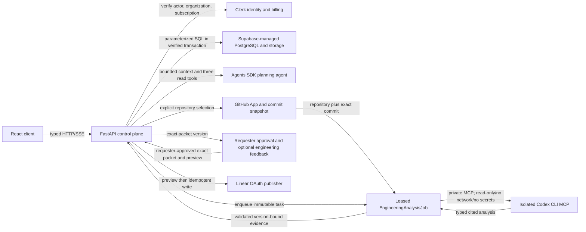
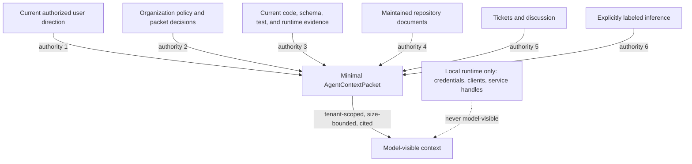
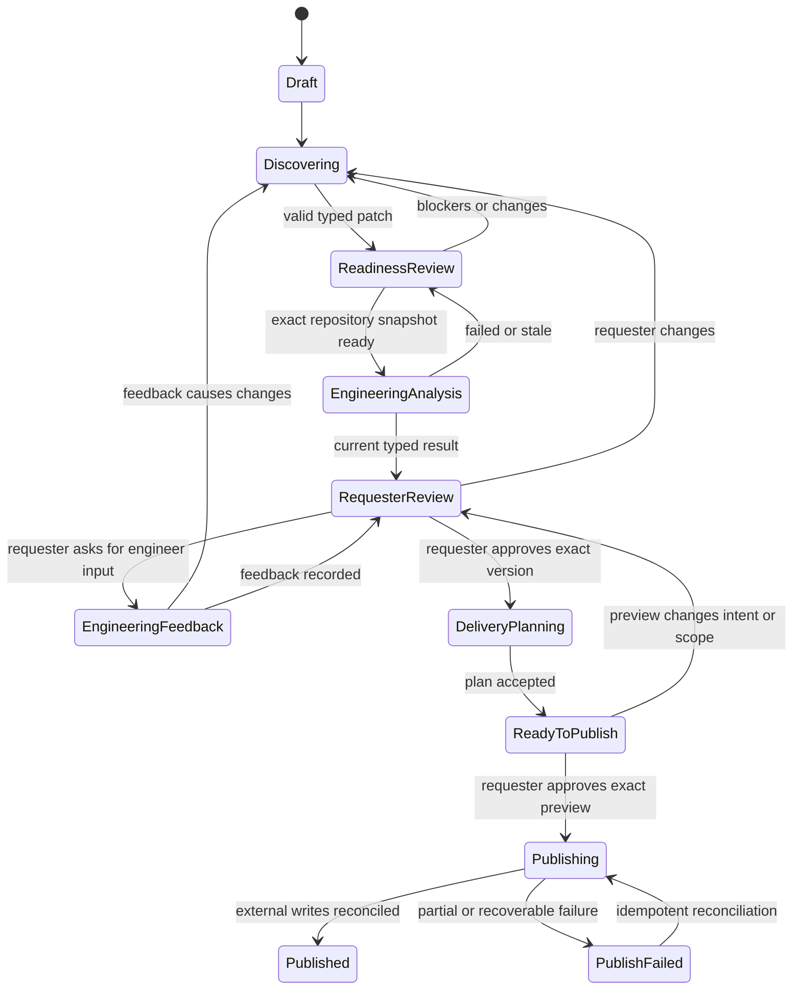
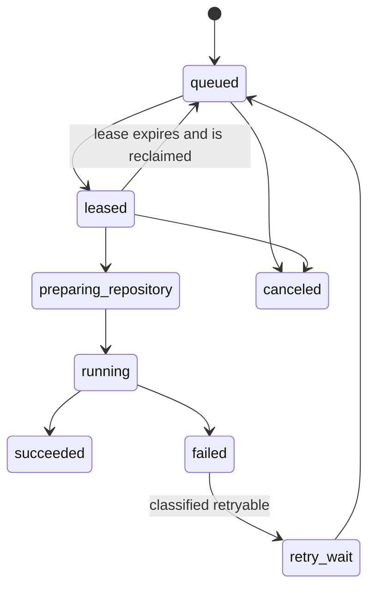
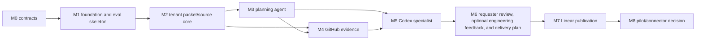

# System Architecture and Decision Records

## Status and ownership

This is the M0 system contract for Clio's simplest secure V1. It records
planned boundaries and verification obligations; it is not evidence that the
runtime, integrations, environments, tests, or provider calls exist.

STE-40 is the upstream authority for pricing, unified usage, and credential
semantics. This document consumes that contract. STE-42 separately owns the
concrete repository tree, feature slices, contract/table registry, module
guardrails, and architecture-test layout. M1 may import and adapt the pinned
Rivet foundation only after both contracts and the M0 evaluation contract are
accepted.

## Accepted V1 boundary

- React/TypeScript provides chat with native built-in/workspace-tool selection,
  a right-side packet artifact, review, usage-status, and publication surfaces.
- FastAPI/Pydantic is the API/control plane; deterministic application and
  domain services own authorization, transitions, persistence, and effects.
- Clerk is the only user/organization identity authority. Clerk Billing owns
  subscription state and billing-period boundaries.
- Supabase-managed PostgreSQL/storage owns durable Clio state. Runtime data
  access uses raw parameterized SQL, versioned Supabase CLI migrations, a
  non-owner/non-superuser/no-`BYPASSRLS` role, verified transaction-local
  actor/organization context, explicit organization predicates, and RLS as
  defense in depth. SQLAlchemy and Alembic are not used.
- One Clio Planning Agent uses the OpenAI Agents SDK, three bounded read tools,
  and typed `PlanningTurnResult`. A custom Postgres-backed Agents SDK `Session`
  is the only planning-conversation continuation strategy.
- Built-in templates and tenant-scoped workspace tools are versioned,
  declarative question/guidance/context/output contracts. They grant no
  executable behavior. Members may discover/use them; creators and Admins own
  changes; packets retain the exact selected version.
- A least-privilege GitHub App supplies explicitly selected, on-demand,
  commit-pinned repository snapshots.
- One Postgres-backed leased `EngineeringAnalysisJob` worker invokes Codex CLI
  as a private MCP server in an isolated read-only, no-network, no-application-
  secrets boundary. It returns typed, packet/commit-version-bound
  `EngineeringAnalysisResult` evidence.
- One requester approval of the exact packet and publication preview is the V1
  publication authority. Human engineering feedback is optional, remains
  version-bound, and never transfers implementation authority. Codex is
  advisory and cannot approve.
- Linear publication uses OAuth, destination selection, exact preview,
  requester approval, idempotency, and partial-success reconciliation.
- External Clio MCP and direct conversation connectors are not V1 critical-path
  dependencies.

## Typed component and control graph



The model intelligence plane may clarify, synthesize, propose a typed packet
patch, or analyze a repository. The deterministic control plane alone chooses
tenant scope, validates schema and legal transitions, persists state, grants
leases, records approvals, holds credentials, and commits external effects.

## Typed data and provenance graph

```mermaid
flowchart LR
    SRC["Authorized paste, upload, selected repository, or workspace tool"]
    WT["Versioned declarative workspace tool"]
    EV["Versioned evidence and provenance"]
    CL["Fact, inference, assumption, unknown, or conflict"]
    PV["Immutable Build Packet version"]
    AC["Requirements and acceptance criteria"]
    EA["EngineeringAnalysisResult at packet plus commit"]
    RV["Requester approval and optional engineer feedback"]
    DP["Destination-neutral delivery plan"]
    EX["Linear records and external IDs"]
    VE["Verification evidence"]

    WT -->|"guides questions/output; no executable authority"| SRC
    SRC -->|"captured as"| EV
    EV -->|"supports/conflicts with"| CL
    CL -->|"shapes"| PV
    PV -->|"contains"| AC
    PV -->|"analyzed with exact repository commit"| EA
    EA -->|"advises; never approves"| RV
    RV -->|"authorizes exact version"| DP
    DP -->|"published as"| EX
    AC -->|"verified by"| VE
    EX -->|"retains trace to"| AC
```



Every version-bound record carries its organization and exact object/version
identity. Provider DTOs stop at adapters. Pydantic owns application/wire
contracts, PostgreSQL DDL owns stored invariants, and generated OpenAPI/JSON
Schema owns the TypeScript API boundary.

## Context and authority graph



`AgentContextPacket` contains the verified actor/organization, workflow and
packet versions, bounded objective/scope, accepted decisions, invariants,
relevant artifact/evidence references, allowed tools/source scopes, output
schema version, required verification, risks, unknowns, and stop/escalation
conditions. It excludes unrestricted history, credentials, database clients,
provider handles, and service-role material.

## Distinct state and recovery contracts

| Concern | Durable owner | Resume/retry meaning | Must not be conflated with |
| --- | --- | --- | --- |
| Saved chat | Postgres-backed Agents SDK Session items | Reopen later with accepted history | SSE reconnect or provider continuation IDs |
| Live stream | Persisted run events and monotonic cursor | Replay after the last acknowledged cursor or fetch terminal state | Durable message truth |
| Planning/model retry | Workflow run, idempotency key, packet base version | Repeat a bounded attempt without applying a duplicate patch | Worker lease recovery |
| Approval resume | Exact packet version and paused workflow state | Continue only after an explicit valid human decision | Model or Codex approval |
| Worker recovery | Job, lease expiry, attempt, failure class | Reclaim an expired lease and continue toward one terminal result | Browser/session survival |
| Publication retry | Publication record, preview/approval, external IDs | Reconcile partial success and avoid duplicate logical work | Asking a model to repair external state |

Only one planning turn may mutate a conversation/packet at a time. Every Codex
job binds organization, packet/version, repository/commit, input hash,
agent/skill/prompt/model/schema versions, budget, lease, attempt, trace, and
result/failure. Packet or commit changes make prior analysis stale.

## Typed workflow and job state graph





A model may propose typed output; domain code alone applies these transitions.
A Codex result, optional engineering feedback, and requester approval are
separate claims.

## Usage control graph

The normative fields, formula, deterministic fixtures, and secret matrix live
in the [STE-40 pricing, usage, and environment contract](pricing-usage-and-environment-contract.md).

```mermaid
flowchart LR
    CS["Clerk subscription snapshot and period"]
    PP["Versioned PlanPolicy"]
    UP["Organization UsagePeriod"]
    RS["Atomic bounded reservation"]
    PX["Provider execution"]
    UE["Raw usage plus normalized UsageEvent"]
    CV["Versioned price plus CostSnapshot"]
    ST["Commit actual or record non-customer class"]
    PU["Percentage, warning state, reset time"]

    CS -->|"authorizes boundary"| UP
    PP -->|"sets shared allowance"| UP
    UP -->|"available >= requested"| RS
    RS -->|"only after success"| PX
    PX -->|"append evidence"| UE
    UE -->|"integer micro-USD"| CV
    CV -->|"settle once; release remainder"| ST
    ST -->|"customer-safe projection"| PU
```



M0 uses synthetic fixtures only. The first real planning-model response and
baseline-versus-candidate run belong to M1 after its entry gate; no M0 provider
call is permitted. **M0 makes no provider call.**

## Lifecycle completeness matrix

| Boundary | Entry/consent | First value | Failure and recovery | Revoke/offboard | Retention |
| --- | --- | --- | --- | --- | --- |
| Clerk actor/organization | Sign up/login, create org or accept invite, choose active org | Create first packet under backend-verified membership | Expired session and out-of-order webhook reconciliation | Remove member or delete org; deny access immediately | Identity/audit references per accepted policy; delete tenant content through controlled workflow |
| Subscription/shared usage | Organization checkout and signed snapshot | Resolve allowance, reserve, execute, settle | Webhook replay, denial on exhaustion, release/settle recovery, immediate upgrade/end-cycle downgrade | Cancel subscription; keep permitted reads/exports | Immutable price/usage evidence and billing audit for declared period |
| Workspace tools | Member selects a built-in tool or creates a tenant-scoped declarative form | Ask declared questions while retaining freeform chat; bind exact version to packet | Invalid/stale tool version fails closed; reload or duplicate current version | Creator/Admin archives; existing packets retain immutable version reference | Creator/change/version audit retained with packet provenance |
| GitHub | Admin installs app and explicitly selects repository | Resolve one on-demand exact-commit snapshot | Rate-limit/health error, reconnect, rerun stale snapshot | Revoke installation/selection; deny new reads | Derived snapshot/evidence expires or deletes per source policy |
| Engineering job/Codex | Packet and selected commit pass readiness; enqueue immutable task | Valid typed cited result reaches packet review | Lease reclaim, bounded retry, cancel, stale/rerun, safe terminal failure | Revoke repository access; cancel queued/leased work where legal | Task/result/trace references retained by policy; checkout destroyed |
| Review | Assign requester; optionally request engineer feedback on an exact packet version | Record one requester approval plus any separate feedback | Consequential changes invalidate approval and stale prior feedback | Remove responsibility/actor access; require requester reassignment | Approval, feedback, invalidation, and waiver audit retained |
| Linear | Authorized requester/publisher completes OAuth and chooses destination | Approve exact preview and publish approved plan exactly once | Rate limit/reconnect and partial-success reconciliation | Revoke OAuth; block new writes while preserving external IDs | Publication receipts, IDs, approval, and reconciliation audit retained |

## Trust-boundary contract

| Boundary | Authority | Input validation | Audit | Failure behavior | Recovery | Retention |
| --- | --- | --- | --- | --- | --- | --- |
| Browser → FastAPI | Clerk-verified actor and active membership | Pydantic schema, stable IDs, optimistic version, organization resolved server-side | actor/org/request/outcome without secrets | Safe stable error; no unauthorized read/write | Reauthenticate, reload accepted version, retry idempotently | Request/security audit under policy; no raw secret logging |
| FastAPI → Postgres | Application use case in verified transaction | Parameterized SQL, explicit org predicate, constraints, transaction-local context | mutation, version, actor/org, decision | Roll back atomically; map safe domain error | Retry only classified transient/idempotent work | Domain retention plus append-only audit; RLS enforced |
| FastAPI → Planning agent | Deterministic control plane | Minimal context, allowed tools, typed final output schema, budget/stop rule | prompt/skill/model/schema versions, tool spans, redaction decision | Reject invalid output; no partial mutation | Bounded retry or ask/escalate without duplicate patch | Trace/result references under eval/privacy policy |
| GitHub → snapshot | App installation plus explicit repository selection | State verification, installation/repository identity, exact commit | install/selection/commit/source locations | No fallback to broader access or moving branch head | Reconnect/reselect/rerun at a resolved commit | Derived data follows source retention/deletion |
| Worker → Codex MCP | Immutable EngineeringAnalysisTask and valid lease | Read-only checkout, allowlisted input/output schema, budget/timeout | task/lease/attempt/config versions and cited result | No write, network, approval, publish, or secret access; terminate safely | Reclaim/retry/cancel by classified job state | Destroy checkout; retain redacted result/trace references by policy |
| FastAPI → Linear | Authorized requester/publisher plus exact packet and preview approval | OAuth state/PKCE, destination IDs, packet/plan/tool versions, idempotency key | preview, approval, requests, responses, external IDs | Stop on unsafe/unknown state; record partial success | Reconcile known IDs then retry missing writes | Publication and reconciliation receipt per policy |

No model chooses its tenant, receives a provider credential, grants approval,
or directly performs a consequential external write.

## Architecture decision records

### ADR-001 — Planning conversation continuation

- **Decision:** use one custom Agents SDK `Session` backed by Clio Postgres.
- **Reason:** Clio owns durable history, approvals, tenant scope, and recovery.
- **Constraint:** do not also replay full history or layer
  `conversation_id`/`previous_response_id` onto the same conversation; provider
  response IDs are trace metadata only.
- **Revisit when:** current official SDK guidance or measured recovery behavior
  demonstrates a safer single replacement strategy.

### ADR-002 — Tenancy and persistence

- **Decision:** raw parameterized SQL plus Supabase CLI migrations, explicit
  organization predicates, verified transaction-local context, and RLS defense
  in depth under a least-privilege application role.
- **Reason:** tenant authority and stored invariants stay explicit and testable.
- **Constraint:** no runtime service-role identity, SQLAlchemy, Alembic, or
  migrations on app startup.
- **Revisit when:** a measured alternative preserves or improves every
  cross-tenant, migration, pooling, and least-privilege proof.

### ADR-003 — Codex execution

- **Decision:** invoke Codex CLI as a private MCP specialist from a leased
  worker using an isolated read-only checkout with no network or application
  secrets.
- **Reason:** repository reasoning has a distinct duration, trust boundary, and
  output contract.
- **Constraint:** Codex returns advisory typed findings; it cannot edit,
  approve, mutate product state, or publish.
- **Revisit when:** a supported execution mechanism produces stronger measured
  sandbox, provenance, quality, latency, or cost evidence without weakening
  the boundary.

### ADR-004 — Durable background work

- **Decision:** one Postgres-backed `EngineeringAnalysisJob` queue with leases,
  attempts, cancellation, retry classification, and terminal results.
- **Reason:** only repository analysis needs durable work in V1; another broker
  would add an unproven state owner.
- **Constraint:** browser disconnect does not cancel accepted work, and an
  expired lease never proves a process survived.
- **Revisit when:** measured load/reliability requires another queue while
  preserving idempotency, recovery, and audit semantics.

### ADR-005 — Repository evidence

- **Decision:** use a least-privilege GitHub App, explicit repository
  selection, and on-demand snapshots pinned to an exact commit.
- **Reason:** citations and Codex results must be reproducible without broad
  indexing.
- **Constraint:** moving branch names are never evidence identities; revoked
  access denies new reads and follows deletion policy.
- **Revisit when:** pilot evidence justifies a different source strategy with
  equal consent, provenance, scope, freshness, and retention controls.

### ADR-006 — Linear publication

- **Decision:** keep delivery planning destination-neutral; publish through a
  deterministic Linear OAuth adapter only after destination selection, exact
  preview, one requester approval, and idempotency setup.
- **Reason:** a model must not repair or guess consequential external state.
- **Constraint:** partial success records external IDs and reconciles before
  retry; optional engineering feedback cannot substitute for or block the
  requester's exact packet/preview approval.
- **Revisit when:** another destination is accepted through its own adapter
  contract without weakening preview, approval, traceability, or recovery.

## Evaluation and observability map

| Requirement | Planned verification owner | Retained evidence contract |
| --- | --- | --- |
| Planning tool/output boundary | Pydantic/tool contract tests plus labeled planning evals | schema result, prompt/skill/model versions, redacted trace reference |
| Tenant and RLS boundary | repository integration, pooled-context, and two-organization isolation tests | migration/role policy plus test result and audit sample |
| Shared usage and settlement | STE-40 arithmetic, concurrency, cancel/retry/reset fixtures | usage/price/cost fixture version and deterministic result |
| Chat/stream/approval recovery | state-machine and ordered/deduplicated stream tests | event cursor, terminal reconciliation, invalidation result |
| GitHub snapshot provenance | adapter tests with selected repository/exact commit/revoke | installation/selection/commit and citation-resolution result |
| Job and Codex isolation | lease-death/cancel/retry tests plus sandbox contract tests | task/attempt/config/result versions and redacted trace reference |
| Review authority separation | workflow transition and staleness tests | exact packet/tool versions, requester approval, and separate optional engineering feedback |
| Linear safety | OAuth state, preview, idempotency, partial-reconciliation tests | approval, idempotency record, external IDs, reconciliation receipt |
| M0–M8 order | machine topological-sort check over the edge registry below | node/edge count and acyclic result |

Traces explain what ran; they do not prove correctness. Model graders assist
with quality but do not replace deterministic gates or human-calibrated release
decisions. Private conversations and repository contents do not become a
permanent evaluation corpus without authorization, redaction, and retention.

## Dependency order and acyclic edge registry



The following registry is the machine-checked source for the diagram:

<!-- milestone-dag:start -->
```text
M0 -> M1
M1 -> M2
M2 -> M3
M2 -> M4
M3 -> M4
M3 -> M5
M4 -> M5
M5 -> M6
M6 -> M7
M7 -> M8
```
<!-- milestone-dag:end -->

The accepted system-architecture chain is `STE-40 -> STE-6 -> STE-42 -> M1`.
STE-5 is the upstream product-contract prerequisite for STE-40 and STE-6.
STE-34 is a separate M0 evaluation-contract gate that must also join before M1;
this execution processes it after STE-42 without inventing another dependency
edge. External Clio MCP and direct conversation connectors have no edge into
the V1 critical path.

## M1 entry gate

M1 may begin foundation/evaluation work only when:

1. STE-5, STE-40, STE-6, STE-42, and STE-34 each have a completion receipt,
   ticket-labeled commit, and the grouped draft PR link;
2. the repository and linked Linear contracts have no semantic conflict;
3. the M0–M8 and issue dependency graphs pass an acyclic check;
4. STE-34 supplies 8–12 labeled synthetic/redacted cases, rubrics, metadata,
   thresholds, privacy rules, and the comparison protocol;
5. the candidate Rivet commit is explicitly pinned, its copied/licensed
   boundary is inventoried, and inherited checks are rerun after import before
   any behavior is credited to Clio;
6. future Codex/job events remain synthetic until M5; and
7. the first real M1 planning-model response is bounded by the STE-40 price,
   development credential, usage persistence, failure classification, and
   redaction gates; and
8. the accepted M0 branch has reached `origin/main` through an explicit human
   merge decision and the user has launched the M1 execution goal.

The first real baseline-versus-candidate model run is an M1/STE-37 action, not
M0 evidence. The M0 review form remains an honest historical record: its five
slots were not completed and must not be backfilled or represented as evidence.
PR #1 nevertheless reached `origin/main` through the repository owner's merge
decision, and the explicitly launched M1 goal accepts that merged state as the
current entry authority. STE-7 records and reconciles the stale PR description
without inventing the missing review evidence.

## Current source basis

The linked Linear architecture records the candidate Rivet snapshot as commit
`cf116a9968d59f2c72b900cbc42a5f3ab5a9acf4`. Its inspected capabilities are
source evidence only. No Rivet code is present or credited as verified Clio
behavior in M0.

Current official platform references:

- [OpenAI Agents SDK overview](https://developers.openai.com/api/docs/guides/agents)
- [Choose one conversation strategy](https://developers.openai.com/api/docs/guides/agents/running-agents#choose-one-conversation-strategy)
- [Agents SDK MCP and observability](https://developers.openai.com/api/docs/guides/agents/integrations-observability)
- [Codex CLI as MCP with the Agents SDK](https://developers.openai.com/cookbook/examples/codex/codex_mcp_agents_sdk/building_consistent_workflows_codex_cli_agents_sdk)
- [OpenAI agent evaluations](https://developers.openai.com/api/docs/guides/agent-evals)
- [Supabase Row Level Security](https://supabase.com/docs/guides/database/postgres/row-level-security)
- [Supabase Postgres roles](https://supabase.com/docs/guides/database/postgres/roles)
