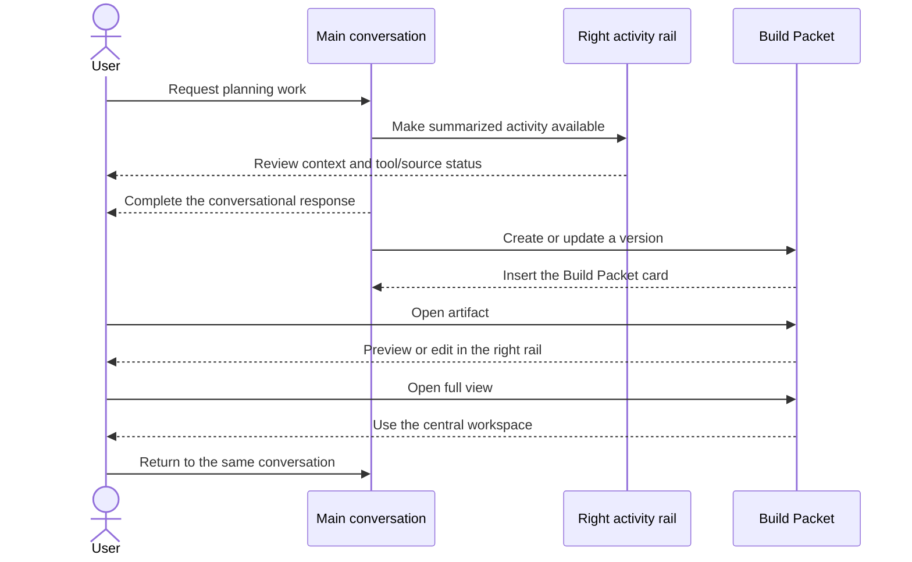

# STE-8 chat-centered artifact interaction contract

Date: 2026-08-03

Status: superseded for desktop layout by `ste-8-codex-workspace-layout.md`; retained for the Packet vocabulary, durability, and mobile-sheet rules

Design authority: repository owner in the corrective Codex task

## Decision

Clio follows a Codex-style hierarchy. The initial rail/workspace arrangement below has been superseded on desktop by the persistent resizable split workspace in [`ste-8-codex-workspace-layout.md`](./ste-8-codex-workspace-layout.md).

- the main workspace owns the conversation and completed work;
- a Build Packet appears in the conversation as a durable artifact card;
- a normal card click opens a Codex-like right-side document preview/editor so the conversation remains visible;
- the Packet rail can promote the artifact into a central full view, with an explicit path back to the originating conversation;
- the contextual right rail shows either the selected artifact or safe execution activity, tools, sources, status, and recovery detail—never both at once;
- raw private chain-of-thought is never displayed;
- the right rail must never compress the main conversation into an unusable strip.

This product decision supersedes the earlier corrective-goal adaptation that placed the Build Packet in a Rivet detail drawer. The owner explicitly rejected that hierarchy after inspecting the running UI and approved the chat-centered flow diagrams in the same task.

## Interaction flow

## Surface matrix

| Surface | Required behavior | Classification | Evidence |
| --- | --- | --- | --- |
| Conversation | Remains the primary work surface | exact Rivet language | desktop/mobile Rivet comparisons |
| Packet card | Appears after the transcript as a first-class saved artifact | owner-authorized Clio adaptation | deterministic inline-card capture and component test |
| Packet rail | Normal card click opens a right-side preview/editor while chat remains visible | owner-authorized Clio adaptation | deterministic rail capture and edit/save browser flow |
| Packet workspace | Optional full view replaces the main chat content temporarily | owner-authorized Clio adaptation | deterministic populated/empty workspace capture and browser flow |
| Back to conversation | Returns from the Packet workspace without changing conversation identity | owner-authorized Clio adaptation | component/browser interaction |
| Activity trigger | Appears inline with an active or evidence-bearing assistant response | adapted Rivet activity language | streaming/activity captures |
| Contextual rail | Shows either Packet content or activity; opening one closes the other | owner-authorized Clio adaptation | component/browser interaction |
| Activity rail | Uses the right side; shows safe stages, tools, sources, duration, and status | adapted Rivet detail pattern | deterministic rail capture and accessibility snapshot |
| Responsive rails | Packet and activity rails overlay as full-width sheets below the desktop breakpoint instead of crushing chat | exact Rivet responsive behavior | deterministic mobile captures |

## Copy boundary

Customer-facing surfaces use `Build Packet`, `Draft`, `Version`, `Open`, `Back to conversation`, `Save new version`, and `Continue in chat`. They do not expose implementation phrases such as `versioned fixture artifact`, `fixture packet`, or `evaluation boundary`.

Fixture authority remains explicit in the organization footer and repository evidence. Removing engineering copy from the Packet surface does not turn the M1 deterministic response into a production-intelligence claim.

## Motion and accessibility

- Packet cards enter with the transcript and do not steal focus.
- Opening a Packet first uses the right rail without a modal trap; `Open full view` changes the central surface.
- Back returns focus to the Packet card when possible.
- The activity rail uses the existing 180 ms Rivet drawer transition and closes with its button or Escape.
- At narrow widths the activity rail overlays the main surface at full available width.
- All icon-only controls retain accessible names and visible focus treatment.

## Verification gate

- Preserve all existing Rivet parity states outside the authorized Packet/activity adaptations.
- Add deterministic no-mask captures for inline Packet, Packet rail, central Packet workspace, and open activity rail on desktop and mobile.
- Label new baselines as Clio product-contract baselines rather than upstream Rivet captures.
- Run typecheck, component/state tests, production build, backend suite, PostgreSQL integration, dependency audit, and real browser QA.
- Require final owner visual acceptance before STE-8 returns to Done.
